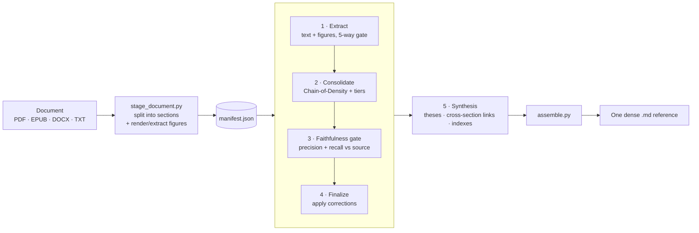

# deep-distill

**Compress an entire document's *wisdom* — not just its word count — into one dense, terse, human-readable reference that loses nothing.** Every formula, definition, named function, parameter, number, caveat, and an explanation of every diagram. Telegraphic ("grammar-sacrifice") by default; readable prose on request.

deep-distill is a [Claude Code](https://claude.com/claude-code) **skill**. It turns a 400-page book or a dense paper into a single reference file by splitting the document into its natural sections and running a federated team of agents over each one — extracting, explaining the figures, and then **adversarially verifying against the source** so nothing is dropped or invented in translation.

> The prompts aren't vibes. Every rule in the pipeline traces to a verified, cited technique from the summarization / knowledge-representation / cognitive-science literature — see [`references/techniques.md`](references/techniques.md).

---

## Why "wisdom, not words"

Ordinary summarization shortens text and averages meaning away. deep-distill is built around the opposite goal — keep the *potency*:

- **Preservation tiers** — the thesis, definitions, numbers, conditions, causal mechanisms, named methods, and formulas are **never** compressed. All compression is spent on examples, restatement, and filler. *(LLMLingua Budget Controller principle.)*
- **Qualifier rule (anti "context-collapse")** — telegraphic style may drop articles and copulas but **never** the `when / where / for-whom / under-what-condition` qualifiers. A claim shorn of its scope reads as universal and is *worse than omission*. *(PropRAG; Molecular Facts.)*
- **Precision + recall faithfulness gate** — a separate agent re-reads the source and checks the draft both ways: every claim must be **supported** (precision — compression can't invent), and every salient source question must be **answerable from the note** (recall — nothing important dropped). *(FActScore / SAFE + QuestEval.)*
- **Chain-of-Density** — holds length fixed while folding in missing salient items, forcing fusion instead of padding. *(Adams et al., 2023.)*
- **Cross-section link layer** — the synthesizer emits labeled `concept —relation→ concept` links *between* sections, the integrative insight a per-section split would otherwise destroy. *(Concept maps; Zettelkasten link-with-a-reason.)*

---

## Example: the Bitcoin whitepaper

The demo distills Satoshi Nakamoto's 9-page [Bitcoin whitepaper](https://bitcoin.org/bitcoin.pdf) — short, famous, freely distributable, with real vector diagrams (the transaction/block chain, Merkle-tree pruning, SPV) and the Poisson double-spend math.

➡️ **[`examples/bitcoin-whitepaper.distilled.md`](examples/bitcoin-whitepaper.distilled.md)**

> 🍎 **Fun fact:** for about five years, *every Mac secretly shipped with the Bitcoin whitepaper.* A copy of `bitcoin.pdf` lived inside macOS as a test page for the Image Capture scanner utility (`/System/Library/Image Capture/Devices/VirtualScanner.app/Contents/Resources/simpledoc.pdf`), from **macOS Mojave (2018)** until Apple quietly removed it in **Ventura 13.4 (2023)**. Nobody at Apple ever publicly explained why it was there. It's a fitting demo input for a tool about hidden, compressed knowledge.

That whitepaper also exposed — and drove — two real upgrades to the stager: its sections have **no PDF bookmarks** (so deep-distill detects in-text numbered headings) and its diagrams are **pure vector line-art** that `get_images()` never reports (so deep-distill detects figures by vector-drawing density too).

---

## How it works



1. **Stage** (`scripts/stage_document.py`) — a plain, deterministic script splits the document (bookmark TOC → in-text headings → page chunks), renders figure pages (raster **and** vector diagrams), and writes a `manifest.json`. Auto-installs [PyMuPDF](https://pymupdf.readthedocs.io/).
2. **Distill** (`references/workflow-template.js`) — the federated [Workflow](https://docs.claude.com/en/docs/claude-code) runs the 5 stages above, one team per section, pipelined for speed. Returns structured JSON.
3. **Assemble** (`scripts/assemble.py`) — stitches the result into one markdown file with a clickable table of contents and the document-level synthesis up top.

The splitting and assembly are cheap scripts; only the judgment work uses agents.

---

## Install

deep-distill is a Claude Code skill. Either:

**A. Clone into your skills directory**
```bash
git clone https://github.com/sirouk/deep-distill ~/.claude/skills/deep-distill
```

**B. Package and install the `.skill` bundle**
```bash
git clone https://github.com/sirouk/deep-distill
# then zip the folder as deep-distill.skill, or use Claude Code's skill packager,
# and open/install the resulting .skill file.
```

Then just ask Claude, e.g. *"deep-distill this PDF in my Downloads"* — the skill triggers on requests to extract/compress/distill a long or figure-heavy document.

### Requirements

- **Claude Code** with the **Workflow tool / subagents** (multi-agent orchestration) — this skill is fundamentally federated and will not run on a single-agent setup.
- **Python 3.8+** (PyMuPDF is auto-installed via `pip --user` on first run).
- Vision-capable model (to read and explain figures).

---

## Usage notes & tuning

- **Density** — pass `density: "readable"` to the workflow for clean prose instead of telegraphic; formulas/figures/caveats are still preserved.
- **Granularity** — `--section-level N` if auto-sectioning is too coarse/fine (aim for ~5–60 chapter-sized units).
- **Figures** — `--dpi 200` for dense plots; `--min-vector-drawings` / `--no-vector-figs` to tune vector-diagram detection.
- **Scope** — the workflow auto-pipelines and caps concurrency; bigger docs just take longer.

## Honest limitations

- **It is lossy.** The dense note discards the source; "nothing lost" means *no salient wisdom* lost (enforced by the faithfulness gate), not literal losslessness. Each claim is anchored to its section for traceability.
- **It costs tokens.** A full book is tens of agents and millions of tokens over several minutes. That thoroughness is the point.
- **Scanned PDFs need OCR first** (image-only pages yield no text).
- The faithfulness gate is a strong reducer of omission/hallucination, **not** a proof of zero error.

## Repository layout

```
deep-distill/
├── SKILL.md                       # the skill: triggering + the pipeline
├── scripts/
│   ├── stage_document.py          # document → sections + figures + manifest
│   └── assemble.py                # workflow result → final markdown
├── references/
│   ├── workflow-template.js       # the federated 5-stage workflow
│   └── techniques.md              # verified, cited research foundation
├── examples/
│   └── bitcoin-whitepaper.distilled.md
├── LICENSE                        # MIT
└── README.md
```

## Acknowledgements

The pipeline stands on published work — Chain-of-Density, LLMLingua, FActScore, SAFE, QuestEval, SummaC, BooookScore, PropRAG, Molecular Facts, Dense X / propositions, concept maps (Novak & Cañas), Zettelkasten, Progressive Summarization, and the Cornell method. Full citations in [`references/techniques.md`](references/techniques.md).

## License

[MIT](LICENSE).
