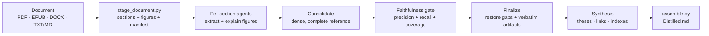
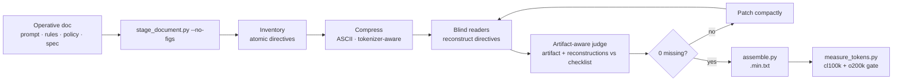

# deep-distill

**Distill a document for a human, or compress it for a machine, without pretending those are the same job.**


deep-distill began as a tool for turning long, dense documents into something a person could actually use: a compact reference that keeps the formulas, caveats, figures, code, numbers, and connective tissue ordinary summaries sand away.

Then a second use case showed up: not "make this nice to read," but "make this smaller so an LLM can consume it every time, without weakening the instructions." That is a different problem. A human note can expand, synthesize, and explain. A machine prompt artifact has to contract, stay ASCII, survive tokenization, and still let another model recover every operative directive without the original.

So deep-distill now has two modes:

| Mode | Reader | Input | Output | Fidelity Test |
|---|---|---|---|---|
| **human** | A person studying the source | Books, papers, manuals, reports, figure-heavy PDFs | A dense `.md` reference with synthesis, figures, Q-cues, links, formulas, code, caveats | Source-grounded faithfulness gate: precision + recall + coverage |
| **machine** | An LLM consuming instructions | System prompts, agent rules, policies, agreements, API/format contracts, operative specs | A token-minimized ASCII `.min.txt` replacement artifact | Blind directive reconstruction + artifact-aware judge + token gate |

The shared instinct is the same: compress meaning, not just words. The verification surface changes because the consumer changes.

---

## Why This Exists

Ordinary summarization optimizes for a shorter surface. deep-distill optimizes for preserved force.

In **human mode**, force means the reader can study the output instead of the source and still recover the load-bearing insight: definitions, assumptions, mechanisms, equations, code, figures, warnings, and how sections relate.

In **machine mode**, force means an LLM can obey the compressed artifact as if it had received the original operative document. That raises the bar: every rule, exception, threshold, permission, prohibition, file path, exact string, and "only/unless/never/even if asked" qualifier has to survive compression.

The method is intentionally suspicious. It does not trust density for its own sake. Earlier versions that bolted on fashionable summarization tricks became terser by dropping subsections, fabricating figure values, and silently "fixing" source typos. The shipped human pipeline was picked only after blind A/B validation. Machine mode inherits that skepticism and adds a stricter round-trip verifier.

---

## How The Modes Work

### Human Mode

Human mode is the original v4 deep-distill pipeline:



It keeps:

- preservation tiers for thesis, definitions, numbers, conditions, causal mechanisms, named methods, formulas, code, worked examples, and exercises
- qualifier protection against context collapse
- verbatim fidelity for code/formulas/symbols, including source typos flagged with `[sic]`
- figure anti-fabrication: report only values that are legible, hedge chart-read values as approximate
- cross-section links so federated section work does not lose the document-level argument

### Machine Mode

Machine mode is prompt compression with a verifier, not a prettier summary:



Machine mode bans rare Unicode as a fake shortcut. The lesson from the prototype work was blunt: symbols can look shorter and still cost more BPE tokens. The real win is deleting filler, fusing duplicate rules, shortening labels, and preserving every qualifier.

The verifier is deliberately blind: reader agents get only the compressed artifact, no original and no decoder key. Then a judge checks every source-derived directive against both the artifact text and the reconstructions. The artifact ships only when the missing list is empty and the token gate passes.

---

## Install

deep-distill is a portable `SKILL.md` skill. The same files work in Claude Code, Codex, and Hermes; only the install directory differs.

```bash
# Claude Code  -> ~/.claude/skills/deep-distill
curl -fsSL https://raw.githubusercontent.com/sirouk/deep-distill/main/install.sh | bash -s -- claude

# Codex        -> ~/.codex/skills/deep-distill
curl -fsSL https://raw.githubusercontent.com/sirouk/deep-distill/main/install.sh | bash -s -- codex

# Hermes       -> ~/.hermes/skills/deep-distill
curl -fsSL https://raw.githubusercontent.com/sirouk/deep-distill/main/install.sh | bash -s -- hermes

# all three
curl -fsSL https://raw.githubusercontent.com/sirouk/deep-distill/main/install.sh | bash -s -- all
```

Manual install:

```bash
AGENT_DIR=~/.codex/skills/deep-distill
mkdir -p "$AGENT_DIR/scripts" "$AGENT_DIR/references"
BASE=https://raw.githubusercontent.com/sirouk/deep-distill/main
for f in SKILL.md scripts/stage_document.py scripts/assemble.py scripts/measure_tokens.py \
         references/workflow-template.js references/techniques.md; do
  curl -fsSL "$BASE/$f" -o "$AGENT_DIR/$f"
done
```

Requirements:

- Python 3.8+
- shell/terminal access
- PyMuPDF for staging PDFs (auto-installed by `stage_document.py` when needed)
- `tiktoken` for machine token gates (auto-installed by `measure_tokens.py` into `~/.cache/deep-distill/token-venv` when needed)
- vision-capable model for human-mode figure explanation
- subagent fan-out or a Workflow runner for the federated stages

---

## Usage

Ask for the mode explicitly:

```text
/deep-distill human @paper.pdf
/deep-distill machine @LLM_OPA.md
```

If no mode is supplied, the skill should ask. It may recommend a mode from the document type: books/papers/manuals usually mean human; prompts/rules/policies/agreements/specs usually mean machine.

### Human Mode Commands

```bash
SKILL_DIR="$HOME/.codex/skills/deep-distill"
python3 "$SKILL_DIR/scripts/stage_document.py" "/absolute/path/to/paper.pdf"
```

Run `references/workflow-template.js` with:

```js
{
  mode: "human",
  title: "<manifest.title>",
  density: "telegraphic",
  sections: <manifest.sections>
}
```

Assemble:

```bash
python3 "$SKILL_DIR/scripts/assemble.py" --mode human \
  --result result.json \
  --manifest "<workspace>/manifest.json" \
  --out "<source dir>/<name> - Distilled.md"
```

### Machine Mode Commands

```bash
SKILL_DIR="$HOME/.codex/skills/deep-distill"
python3 "$SKILL_DIR/scripts/stage_document.py" "/absolute/path/to/rules.md" --no-figs --min-chars 1 --keep-frontmatter
```

Run `references/workflow-template.js` with:

```js
{
  mode: "machine",
  title: "<manifest.title>",
  sections: <manifest.sections>,
  machine_candidates: 3,
  machine_patch_rounds: 3
}
```

Assemble only after the workflow returns `status: "certified"`:

```bash
python3 "$SKILL_DIR/scripts/assemble.py" --mode machine \
  --result result.json \
  --manifest "<workspace>/manifest.json" \
  --out "<source dir>/<name>.min.txt"
```

Measure:

```bash
python3 "$SKILL_DIR/scripts/measure_tokens.py" \
  --compare "/absolute/path/to/rules.md" "<source dir>/<name>.min.txt" \
  --require-smaller --require-ascii
```

The final delivery should report directive recovery, missing count, ASCII status, and token counts for `cl100k_base` and `o200k_base`.

---

## Validation

Human mode was validated with blind, source-grounded A/B tests across three method rounds. The important lesson: "more SOTA" was not automatically better. A fixed-length Chain-of-Density pass improved terseness while dropping content. A completeness-first rewrite stopped some hallucination but began silently correcting literal artifacts. The shipped v4 method kept the original keep-everything, verbatim-fidelity core and added only the pieces that independently helped: figure anti-fabrication, cross-section links, Q-cues, and qualifier preservation.

See [`EVALUATION.md`](EVALUATION.md) for methodology and scores.

Machine mode uses a separate validation surface:

- source-derived atomic directive checklist
- blind reconstruction from the compressed artifact alone
- artifact-aware judge, so the verifier does not chase phantom misses caused by reader under-enumeration
- patch loop until zero genuine gaps
- tokenizer measurement on `cl100k_base` and `o200k_base`

That is strong practical evidence of functional equivalence. It is not a mathematical proof that every model will obey the compressed artifact identically.

---

## Tuning

| Knob | Applies To | Effect |
|---|---|---|
| `density` = `telegraphic` or `readable` | human | terse reference vs compact prose |
| `--section-level N` | both | choose heading depth for sectioning |
| `--chunk-words N` / `--min-chars N` | both | tune section size for text docs |
| `--dpi 200` | human | sharper rendered figure pages |
| `--no-figs` | machine | skip image work for text-only operative docs |
| `machine_candidates` | machine | number of compression variants to verify |
| `machine_patch_rounds` | machine | max rounds to restore missing directives |

---

## Honest Limits

- Human mode is not literal losslessness. It aims for no salient wisdom lost, enforced by a faithfulness gate.
- Machine mode can fail honestly. If the source is already compact, the token gate may reject the artifact.
- Scanned PDFs need OCR before staging.
- Figure explanation depends on image legibility.
- LLM judges reduce risk; they do not remove it.
- Machine artifacts should be reviewed before replacing high-stakes instructions.

---

## Repository Layout

```text
deep-distill/
├── SKILL.md                       # mode dispatch + human/machine operating contract
├── install.sh                     # installer for Claude Code / Codex / Hermes
├── scripts/
│   ├── stage_document.py          # document -> sections + figures + manifest
│   ├── assemble.py                # workflow result -> Distilled.md or .min.txt
│   └── measure_tokens.py          # machine token gate via tiktoken
├── references/
│   ├── workflow-template.js       # federated human workflow + machine certification path
│   └── techniques.md              # research foundation
├── EVALUATION.md                  # validation methodology
├── CHANGELOG.md
├── LICENSE
└── README.md
```

## Acknowledgements

The pipeline draws on Chain-of-Density, LLMLingua, LLMLingua-2, FActScore, SAFE, QuestEval, SummaC, BooookScore, PropRAG, Molecular Facts, propositions, concept maps, Zettelkasten-style links, Progressive Summarization, and the Cornell method. The citations and caveats live in [`references/techniques.md`](references/techniques.md).

## License

[MIT](LICENSE).
